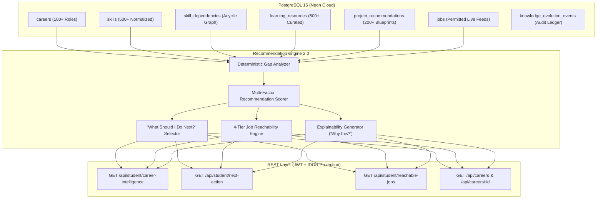

# SkillBridge 3.0 — Career Intelligence Architecture
## Technical Specification & System Design

---

## 1. Executive Summary & Objective

SkillBridge 3.0 evolves from an assessment matching platform into an enterprise-grade **Career Intelligence Graph**. It models complex, multidirectional relationships among:
- **Careers** (100+ defined engineering & tech tracks)
- **Skills** (500+ normalized competencies across 18 domains)
- **Skill Dependencies** (Directed Acyclic Graph of prerequisites and specializations)
- **Learning Resources** (500+ official documentation manuals, university courses, tutorials, and canonical YouTube videos)
- **Project Blueprints** ("Build This Next", 200+ portfolio deliverables)
- **Live Job Opportunities** (Deduplicated, verified developer roles)
- **Students & Proof-of-Skill Evidences** (Verifications, assessments, work artifacts, GitHub signals)

---

## 2. Existing System Audit & Integration Surface

### 2.1 Database Tables Audited
- `users`: Core identity, roles (`student`, `company`, `admin`, `college`).
- `students`: Profile, trust score, GPA, college reference.
- `skills`: Master skills catalog.
- `student_skills`: Verified/declared student competencies with proof levels.
- `jobs` & `job_skills`: Active market opportunities and requirements.
- `career_goals`: Student target role and target timeline.
- `career_roadmaps` & `career_roadmap_steps`: Multi-phase milestone execution.
- `skill_gap_analysis`: Partitioned gaps (`strong`, `needs_improvement`, `missing`).
- `learning_resources`: Production course, documentation, and video catalog.
- `student_learning_progress`: Resource completion and time tracking.
- `weekly_career_plans` & `career_plan_tasks`: 7-day adaptive planner.
- `knowledge_evolution_events`: Immutable audit ledger of student progression.
- `skill_dependencies`: Prerequisite edges.
- `student_achievements`: Badges and streak records.
- `data_source_registry`: External data source governance.
- `project_recommendations`: Hands-on project blueprints.
- `staging_*`: Isolated staging tables (`staging_learning_resources`, `staging_projects`, `staging_jobs`).

### 2.2 Reused Architecture & Services
1. **`CareerEvolutionService.php`**: Retained for roadmap generation, weekly plan generation, and knowledge evolution logging.
2. **`DataRecommendationService.php`**: Extended into `CareerRecommendationService.php` with multi-factor scoring.
3. **`ProofOfSkillService.php`**: Trust score calculations (30% verification, 20% assessment, 15% proof-of-work, 10% AI interview, 10% project, 10% resume, 3% GitHub, 2% self-declaration).
4. **`SkillEvidenceService.php`**: Unified evidence graph resolution.
5. **`GeminiService.php`**: AI career coaching with `<candidate_untrusted_input>` prompt-injection barrier and fallback.

---

## 3. Career Intelligence Graph Data Flow

---

## 4. Multi-Factor Scoring Formula

For any resource, project, or action $a$ recommended for student $s$ targeting career $c$:

$$\text{Score}(a, s, c) = w_{\text{gap}} \cdot R_{\text{gap}} + w_{\text{prereq}} \cdot A_{\text{prereq}} + w_{\text{career}} \cdot M_{\text{career}} + w_{\text{diff}} \cdot F_{\text{diff}} + w_{\text{qual}} \cdot Q_{\text{res}} + w_{\text{fresh}} \cdot T_{\text{fresh}}$$

Where weights are calibrated to:
- $w_{\text{gap}} = 0.30$: Relevance to closing top unverified/missing skills.
- $w_{\text{prereq}} = 0.25$: Strict prerequisite alignment (no advanced recommendations before foundational prerequisites are met).
- $w_{\text{career}} = 0.20$: Direct frequency of skill occurrence in target career requirements.
- $w_{\text{diff}} = 0.10$: Difficulty match relative to current student skill level.
- $w_{\text{qual}} = 0.10$: Quality score of resource / project blueprint.
- $w_{\text{fresh}} = 0.05$: Verification recency of resource.

Normalized Output: Strictly bounded between **0 and 100**.

---

## 5. Security & Provenance Controls

1. **Strict Staging & Provenance:** External feeds pass through `staging_*` tables before promotion. Every record references `source_id` in `data_source_registry`.
2. **URL Integrity:** Insecure `http://` or unreachable links are rejected by `DataQualityService`.
3. **SSRF Protection:** Web hooks and feed fetchers block private RFC1918, loopback, and cloud metadata IPs (169.254.169.254).
4. **IDOR & Server-side RBAC:** Student ID is extracted strictly from verified JWT claims. Cross-account access throws `403 Forbidden`.
5. **AI Prompt Injection Defense:** All user input is bounded inside `<candidate_untrusted_input>` tags with escape sequences stripped.
