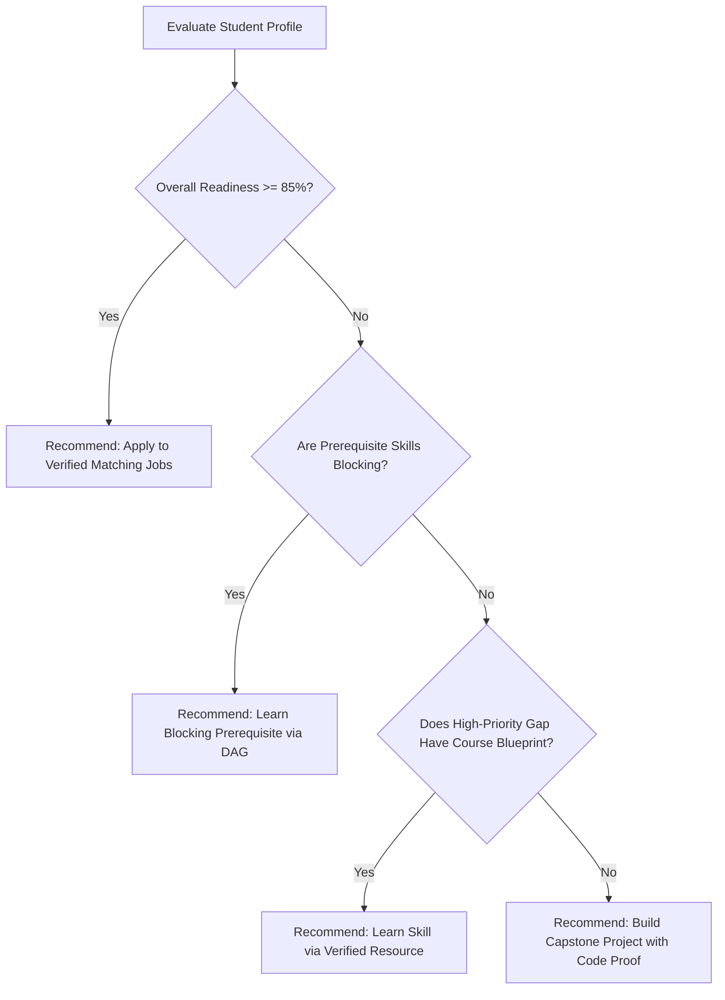

# SkillBridge 3.0 — "What Should I Do Next?" Recommendation Engine

## 1. Engine Objective
The Next Best Action Engine answers the core student question:
> **"What should I do right now to make the greatest impact on my career readiness?"**

Instead of presenting an overwhelming list of courses or projects, the engine synthesizes DAG prerequisites, verified skill gaps, and current readiness into a single prioritized, explainable action.

---

## 2. Decision Hierarchy

---

## 3. Deterministic 6-Factor Scoring Formula

Every catalog item (resource, project, drill) is evaluated against the student's live context using a 100-point multi-factor model:

$$S = 0.30 \cdot F_{\text{gap}} + 0.25 \cdot F_{\text{prereq}} + 0.20 \cdot F_{\text{align}} + 0.10 \cdot F_{\text{diff}} + 0.10 \cdot F_{\text{qual}} + 0.05 \cdot F_{\text{fresh}}$$

### Factor Weights and Semantics

1. **Gap Coverage ($F_{\text{gap}}$ — 30%)**: Does this item target a primary missing skill required for the target career?
2. **Prerequisite Readiness ($F_{\text{prereq}}$ — 25%)**: Are all immediate DAG dependencies satisfied? If a dependency is missing, the dependency itself receives a priority boost.
3. **Career Alignment ($F_{\text{align}}$ — 20%)**: Does the skill belong to the primary career domain (e.g., Frontend Engineering vs DevOps)?
4. **Difficulty Proximity ($F_{\text{diff}}$ — 10%)**: Matches beginner resources to unverified skills, and intermediate/advanced projects to skills with existing baseline evidence.
5. **Resource Quality ($F_{\text{qual}}$ — 10%)**: Quality score derived from community benchmarks, HTTPS compliance, and official documentation sources.
6. **Freshness ($F_{\text{fresh}}$ — 5%)**: Recency of data acquisition and curriculum updates.

---

## 4. Explainability Contract
Every recommendation must produce human-interpretable rationale:
- **Title**: Specific actionable item (e.g., `Learn HTML: Core Mastery & Engineering Guide`)
- **Rationale**: Direct causal explanation (e.g., `HTML is a foundational prerequisite for React and required for Frontend Developer.`)
- **Expected Readiness Boost**: Quantified progress projection (e.g., `+15% Career Readiness`)
- **Direct CTA**: One-click transition to learning, practicing, or building.
