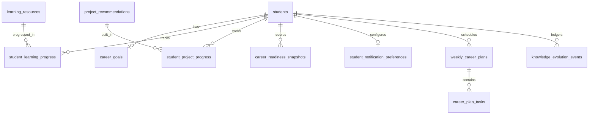

# SkillBridge 3.0 — Personal Career Operating System Architecture
## Technical Design & System Specification

---

## 1. System Overview & Mission

SkillBridge 3.0 evolves from a conventional profile/job board into a **Personal Career Operating System (Career OS)**. The Career OS provides a deterministic, continuous feedback loop that answers 11 fundamental student questions in real-time:

1. **Where am I in my career?** $\rightarrow$ Real-time Career Readiness score & tier.
2. **What skills do I currently have?** $\rightarrow$ Multi-factor verified skill inventory with confidence metrics.
3. **What skills am I missing?** $\rightarrow$ Prerequisite-aware Skill Gap Matrix.
4. **What should I do next?** $\rightarrow$ Deterministic Next Best Action with quantified readiness boost.
5. **What should I learn?** $\rightarrow$ Curated, HTTPS-verified courses and documentation from `learning_resources`.
6. **What should I practice?** $\rightarrow$ Interactive coding drills with automated test criteria.
7. **What project should I build?** $\rightarrow$ Portfolio blueprints with deliverables and starter repo templates.
8. **What should I verify?** $\rightarrow$ Multi-factor proof assessments (assessment, GitHub code, project deliverables).
9. **Which jobs can I realistically target?** $\rightarrow$ 4-tier opportunity matrix (*Ready Now*, *Nearly Ready*, *Skill Gap*, *Future Target*).
10. **How has my career readiness changed?** $\rightarrow$ Historical readiness progression snapshots and ledger.
11. **What should I do this week?** $\rightarrow$ Structured, manageable Monday-to-Sunday weekly study plan.

---

## 2. Architecture & Component Reuse

### 2.1 Reused Production Components
- **`careers` Table (105 Verified Roles)**: Provides career taxonomy across 16 domains with required/preferred skills.
- **`skills` Table (513 Normalized Skills)**: Master skills taxonomy with slugs, domains, aliases, and difficulty.
- **`skill_dependencies` Table (117 Directed Edges)**: Acyclic DAG defining prerequisite hierarchies.
- **`learning_resources` Table (624 Verified Resources)**: 100% HTTPS-compliant educational catalog.
- **`project_recommendations` Table (228 Blueprints)**: Industry blueprints with deliverables and tech stacks.
- **`jobs` Table (57 Active Roles)**: Real company job listings from Arbeitnow & RemoteOK.
- **`CareerRecommendationService.php`**: Computes multi-factor readiness, gaps, and 4-tier reachable jobs.
- **`ProofOfSkillService.php`**: Computes tamper-evident multi-factor skill confidence scores.
- **`CareerEvolutionFlywheel.tsx`**: Interactive 13-stage visual progression loop.

### 2.2 New & Extended Components
- **`migrate_v16.sql`**: Extends `career_goals` with `career_domain`, adds `career_readiness_snapshots`, `student_notification_preferences`, and `career_coach_sessions`/`career_coach_messages`.
- **`CareerInsightService.php`**: Deterministic insight generator producing 5 categories of actionable career guidance.
- **`CareerEvolutionService.php`**: Extended with interactive skill graph generation, lifecycle mutations (`start`/`complete` for learning and projects), weekly plan regeneration, and historical readiness queries.
- **Frontend Pages & Sub-Centers**:
  - `/student/career`: Primary Career Command Center.
  - `/student/skills`: Skill Gap Center.
  - `/student/skill-graph`: Interactive DAG Graph Visualization.
  - `/student/projects`: "Build This Next" Showcase.
  - `/student/evolution`: Knowledge Evolution Growth Ledger.
  - `/student/career-coach`: Grounded, Advisory AI Career Coach.

---

## 3. Database Schema Specification (`migrate_v16.sql`)



1. **`career_goals`**:
   - `secondary_target_role VARCHAR(128)`
   - `career_domain VARCHAR(64)`
2. **`career_readiness_snapshots`**:
   - `id BIGINT GENERATED ALWAYS AS IDENTITY PRIMARY KEY`
   - `student_id VARCHAR(64) NOT NULL REFERENCES students(id)`
   - `target_role VARCHAR(128) NOT NULL`
   - `readiness_score SMALLINT NOT NULL`
   - `readiness_tier VARCHAR(64) NOT NULL`
   - `breakdown JSONB NOT NULL DEFAULT '{}'`
   - `snapshot_date TIMESTAMP WITH TIME ZONE DEFAULT CURRENT_TIMESTAMP`
3. **`student_notification_preferences`**:
   - `student_id VARCHAR(64) PRIMARY KEY REFERENCES students(id)`
   - `skill_gap_alerts BOOLEAN DEFAULT TRUE`
   - `learning_reminders BOOLEAN DEFAULT TRUE`
   - `project_reminders BOOLEAN DEFAULT TRUE`
   - `job_reachability_alerts BOOLEAN DEFAULT TRUE`
4. **`career_coach_sessions` & `career_coach_messages`**:
   - Session management and persistent chat history isolated by authenticated student ID.

---

## 4. API Interface Contracts

| Method | Endpoint | Description | Auth Required |
|:---|:---|:---|:---|
| `GET` | `/student/career-os` | Aggregated master command center payload | Student |
| `GET` | `/student/career-goal` | Active career goal details | Student |
| `POST` | `/student/career-goal` | Create or update active career goal | Student |
| `PUT` | `/student/career-goal` | Modify existing career goal | Student |
| `DELETE` | `/student/career-goal` | Reset active career goal | Student |
| `GET` | `/student/readiness` | Current multi-factor readiness score & tier | Student |
| `GET` | `/student/next-action` | Hero next best action recommendation | Student |
| `GET` | `/student/skill-gaps` | Detailed 3-tier gap breakdown | Student |
| `GET` | `/student/skill-graph` | Node-edge DAG with student state annotations | Student |
| `GET` | `/student/career-insights`| Real database-derived insights | Student |
| `GET` | `/student/learning` | Recommended learning resources | Student |
| `POST` | `/student/learning/{id}/start` | Mark learning resource started | Student |
| `POST` | `/student/learning/{id}/progress`| Update resource completion progress % | Student |
| `POST` | `/student/learning/{id}/complete`| Mark resource completed | Student |
| `GET` | `/student/projects/recommended` | Recommended project blueprints | Student |
| `POST` | `/student/projects/{id}/start` | Mark project blueprint started | Student |
| `POST` | `/student/projects/{id}/complete` | Submit project with repository URL | Student |
| `GET` | `/student/reachable-jobs` | 4-tier opportunity reachability matrix | Student |
| `GET` | `/student/roadmap` | Dynamic DAG-ordered roadmap | Student |
| `GET` | `/student/weekly-plan` | Monday-Sunday weekly tasks | Student |
| `POST` | `/student/weekly-plan/regenerate` | Rebalance weekly study plan | Student |
| `POST` | `/student/weekly-plan/tasks/{id}/complete` | Mark task completed | Student |
| `POST` | `/student/weekly-plan/tasks/{id}/skip` | Skip task | Student |
| `GET` | `/student/evolution` | Chronological verified growth ledger | Student |
| `POST` | `/career-coach/message` | Secure, advisory AI study coach conversation | Student |

---

## 5. Security & Privacy Model

1. **Authentication & RBAC**:
   - Every student route requires a valid JWT bearer token.
   - Strict student ID isolation:
     ```php
     if ($user['role'] === 'student' && $targetStudentId !== $user['id']) {
         errorResponse("Forbidden: You can only access your own career data", 403);
     }
     ```
   - Recruiters cannot access private student career goals, roadmaps, or weekly plans.
2. **AI Safety & Context Isolation**:
   - Student prompts and user-provided profile notes are treated as **UNTRUSTED** input.
   - Encapsulated within `<student_data>` XML delimiters in prompts.
   - Strict output JSON schema validation.
   - Hardcoded deterministic fallback when Gemini API fails, times out, or encounters rate limits.
   - Gemini is strictly advisory: it cannot mutate student database records, bypass verification gates, or grant badges.

---

## 6. Testing & Quality Strategy

1. **Backend Integration Suite (`tests/personal-career-os-test.php`)**:
   - 10 test groups validating Goal CRUD, IDOR isolation, Career OS payload, Skill Graph topological ordering, Deterministic Insights, Learning & Project lifecycles, and AI fallback.
2. **Full Regression Validation**:
   - `career-intelligence-test.php` (41 tests).
   - `data-acquisition-pipeline-test.php` (39 tests).
   - `test-evolution-loop.php`.
3. **Frontend Compilation & Performance**:
   - Zero TypeScript warnings/errors (`npx tsc --noEmit`).
   - Clean SSR production build (`npm run build`).
